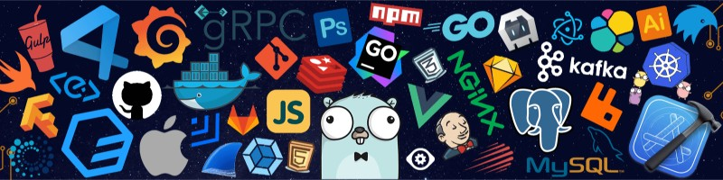

  

# Hi, I'm Shiva Ram 👋

### Full-Stack Developer | Java • Spring Boot • React.js • Node.js | AI Integration

I'm a Computer Science student passionate about building scalable web applications, backend systems, and AI-powered tools. I enjoy working across the full stack — from designing responsive user interfaces to developing APIs, microservices, and intelligent workflows.

---

# 🚀 Tech Stack

## Languages

---

## Frontend

---

## Backend

---

## Databases

---

## AI / LLM

---

## Tools & Platforms

---

# 📌 Featured Projects

## 🗓️ Time Table Generator
AI-powered timetable generation platform with conflict-aware scheduling workflows.

### Features
- Microservices architecture
- Redis worker queues
- Real-time updates with WebSockets
- LangChain & LangGraph workflows
- React Flow visualization

🔗 Repository:  
https://github.com/ramavathshivaram/time-table

---

## 📝 Notebook Web Application
Full-stack notebook platform with AI assistance, drawing support, and rich text editing.

### Features
- JWT authentication
- OpenRouter AI integration
- Persistent notebook storage
- Rich text editor
- Responsive UI

🔗 Repository:  
https://github.com/ramavathshivaram/notebook

---

## 📊 Data Explorer Web Application
Single Page Application built using Vanilla JavaScript and REST APIs.

### Features
- Dynamic filtering & search
- Promise.all optimized API handling
- Client-side state management
- Structured dataset visualization

🔗 Repository:  
https://github.com/ramavathshivaram/Pokemon

---

# 📈 Coding Profiles

- LeetCode: https://leetcode.com/u/Shivaram63/
- CodeChef: https://www.codechef.com/users/shivaram6300

---

# 📫 Connect With Me

- LinkedIn: https://www.linkedin.com/in/ramavath-shiva-ram/
- GitHub: https://github.com/ramavathshivaram
- Email: ramavathshiva6300@gmail.com
