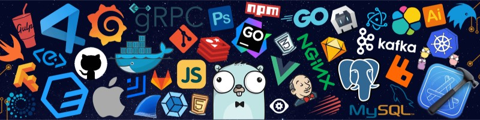

<h1 align="center">Hi 👋, I'm Shiva Ram</h1>

<h3 align="center">
  Full-Stack Developer • AI Engineer • Computer Science Student
</h3>

  

  🚀 Building scalable web applications, AI-powered systems, and high-performance software solutions.

  

## 🚀 About Me

- 🎓 Computer Science Engineering Student
- 💻 Full-Stack Developer specializing in Java, Spring Boot, React.js, Node.js, and MongoDB
- 🤖 AI Enthusiast with hands-on experience in LangChain, LangGraph, RAG, and LLM integrations
- 🚀 Built AI-powered applications, scalable backend systems, and cloud-deployed solutions
- 🏆 Solved 85+ LeetCode problems and strengthened foundations in DSA, OOP, DBMS, OS, and Computer Networks
- ☁️ AWS Certified Cloud Practitioner

## 🛠️ Tech Stack

  

  
  
  
  
  
  

## 📌 Featured Projects

### 📝 AI Notebook App

- AI-powered notebook platform with LangGraph workflows and Groq LLM integration
- Rich text editor, canvas drawing, JWT authentication, and Redis caching
- Dockerized deployment with AWS EC2, Nginx, and GitHub Actions CI/CD
- Achieved 278+ requests/sec with 354ms average latency during load testing

🔗 Repository: https://github.com/ramavathshivaram/notebook

🔗 Live Demo: http://ec2-65-2-177-67.ap-south-1.compute.amazonaws.com

---

### 🗓️ AI Timetable Generator

- Automated timetable generation using AI-driven planning workflows
- Interactive timetable visualization with React Flow
- Redis queues and event-driven architecture for scalable processing
- LangChain-powered scheduling and optimization logic

---

### 🧩 Pokémon Explorer

- High-performance Vanilla JavaScript Single Page Application (SPA)
- Processes 1350+ Pokémon from 160,000+ interconnected PokéAPI resources
- Features search, filtering, comparison, evolution chains, moves, and abilities
- Optimized with LocalStorage caching, lazy loading, and batched API requests

🔗 Repository: https://github.com/ramavathshivaram/Pokemon

## 📈 GitHub Activity

  

## 🌐 Connect With Me

  
  
  

